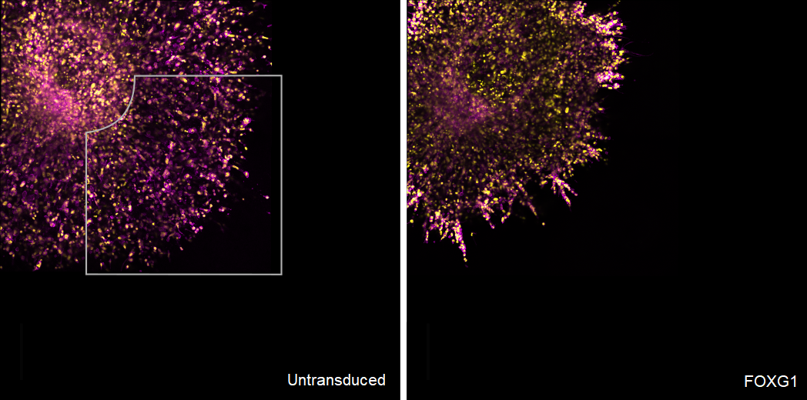
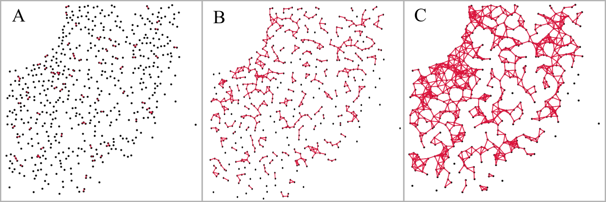

# Graph-Based-Analysis-of-Cell-Migration-and-Radiation
## Different Tumor Spheroids Exhibit Different Invasive Patterns  

## Classifying the Invasive Phenotype by Abstracting the Images into Graphs Consisting of Nodes (black) and Edges (red)

Please see  `Math. Detail of the Cell Invasion Graph.pdf` for a deeper Introduction.  
This repository also includes PYTHON-code for generating Cell Invasion Graphs `Scripts/Graphgenerator.py`. These graphs were used to perform: 
 1. Exploratory Data Analysis of the resulting Cell Invasion Graph metrics
 2. ML predictions to find which of the features of the graph are most responsible for the observed invasive patterns
 3. Deep Learning the patterns of invasion for the different KDs using Pytorch 
 
Notebooks on each of these topics will be made public once the results are published. 
 
Data for creating the graphs and images of cell spheroids are intelectual property of Prof. Dr. Peter Friedl, Radboud University Nijmegen.  
If there are any questions/remarks please write me an e-Mail @tompaulat@gmail.com
